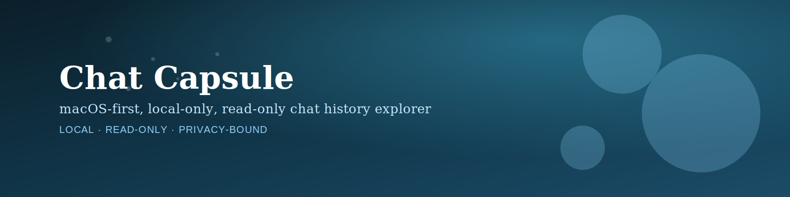

# Chat Capsule

  

  <strong>macOS 优先 · 完全本地 · 只读优先</strong> 

  
  

Chat Capsule 是一个 **macOS 优先、完全本地、只读优先** 的聊天记录查看、分析与导出桌面应用。

它基于上游项目 [WeFlow](https://github.com/hicccc77/WeFlow) 的维护分支继续演进。当前仓库为 **非官方维护分支**，不代表上游官方立场。

## 主要能力

- 本地聊天记录浏览
- 图片 / 视频 / 实况预览与解密
- 联系人查看与导出
- 私聊 / 群聊分析
- 多格式导出（HTML / TXT / CSV / Excel 等）
- 本地 HTTP API（默认关闭、localhost、token 保护）

## 重要说明

- 本项目不提供微信聊天记录“导出 / 解密 / 获取”方案，仅用于对已在本地存在的聊天记录、媒体文件等进行管理、分析与查看。
- 聊天记录导出 / 解密可参考其他项目，例如 [WeFlow](https://github.com/hicccc77/WeFlow) 与 [wechat-decrypt](https://github.com/ylytdeng/wechat-decrypt/tree/main)。
- 本项目的 key 读取逻辑参考了 wechat-decrypt，用户可自行获取并导入。

## 安装版首次使用

面向最终用户的安装包默认不要求修改应用目录。首次启动后，在欢迎页点击“导入配置”，把现有 `profile.json` 导入到应用配置目录即可；配置完成后也可以从欢迎页或设置页“导出 profile.json”用于迁移到其他机器。安装版不会再去扫描 `.app` 包内容或应用目录旁的配置文件。

## 许可证、来源与发布定位

- 上游项目：`WeFlow`
- 上游仓库：[hicccc77/WeFlow](https://github.com/hicccc77/WeFlow)
- 当前发布名：`Chat Capsule`
- 当前仓库许可证：`CC BY-NC-SA 4.0`
- 发布定位：**源码公开（source-available）**、非官方维护分支、非商业分发
- 开源说明：**CC BY-NC-SA 4.0 不是 OSI 认可的开源许可证**
- 额外说明：见 `FORK-NOTICE.md`
- 第三方说明：见 `NOTICE`

如果你继续 fork 或再分发本仓库，请先阅读 `LICENSE`，并确认你的用途符合 **署名、非商业、相同方式共享** 等约束。请不要把本项目表述为上游官方版本、官方续作或可自由商用的软件。

## 致谢

- [密语 CipherTalk](https://github.com/ILoveBingLu/miyu) 提供了基础框架参考
- [WeChat-Channels-Video-File-Decryption](https://github.com/Evil0ctal/WeChat-Channels-Video-File-Decryption) 提供了视频解密相关思路
- 上游项目 [WeFlow](https://github.com/hicccc77/WeFlow) 提供了原始基础能力与方向
